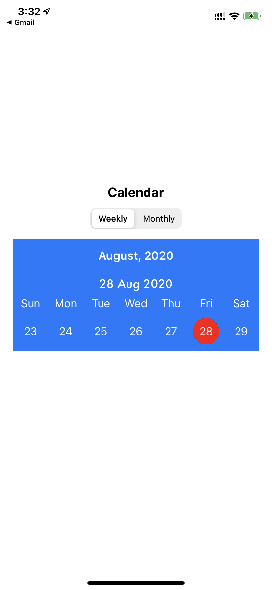
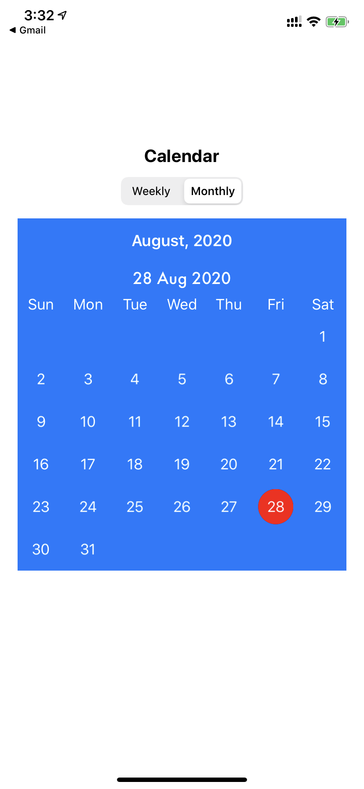
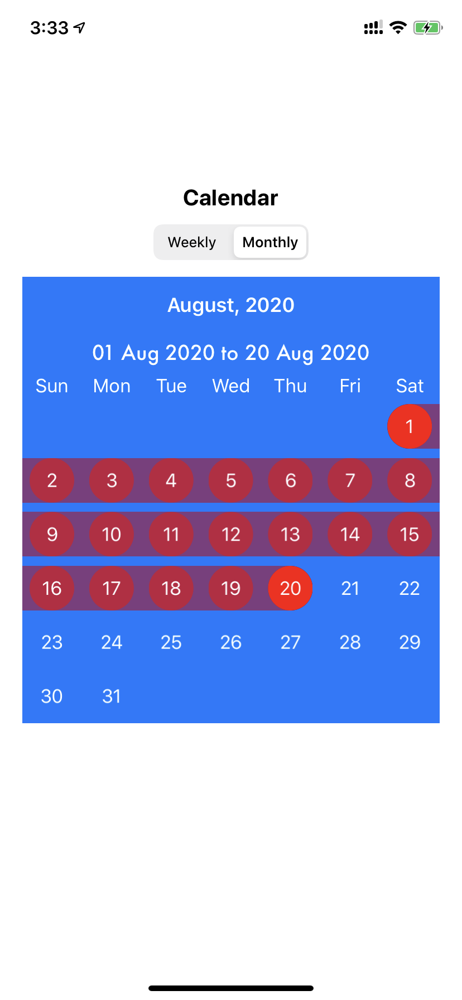
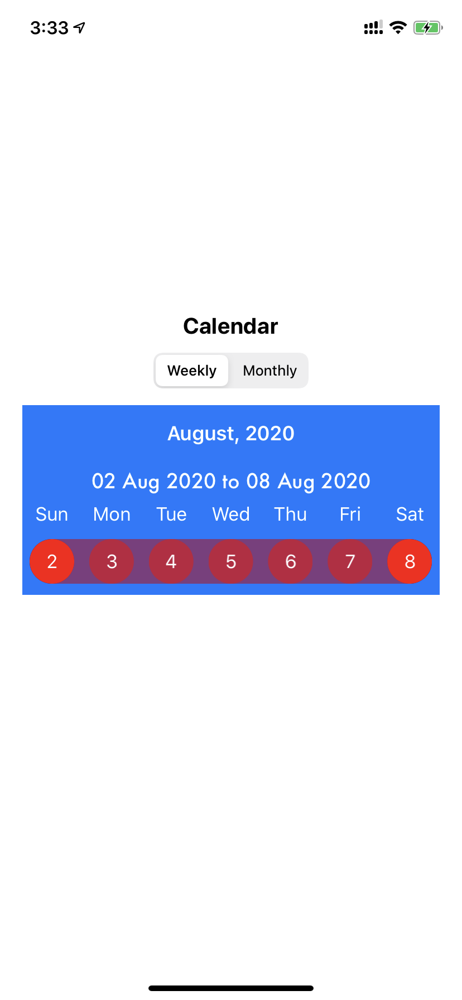

# Custom calendar example which support weekly and monthly calendar modes
customisable calendar created using JTAppleCalendar library which supports weekly(1 row) and monthly(6 rows) calendar types.

* It supports
  - weekly calendar type 
  - monthly calendar type
  - single date selection
  - multiple date range selection
  - fully customisable
 
<B>UIButton which detects long press, single tap and double tap gestures</B>
 
<B>It is useful for creating Whatsapp like audio & video recording button.<B>
 

  

  

  

  

